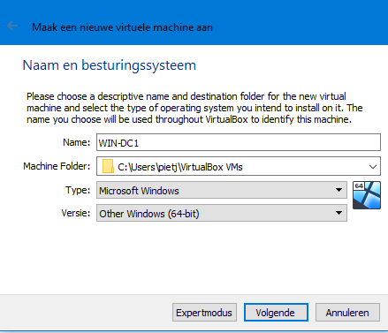
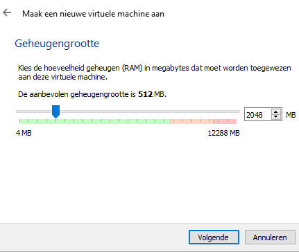
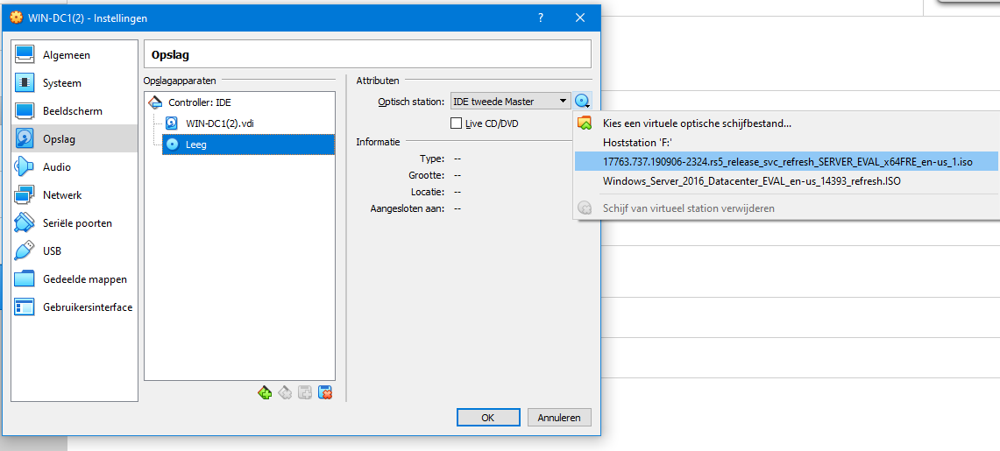
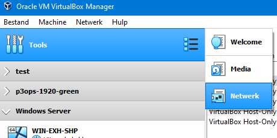
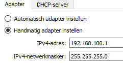
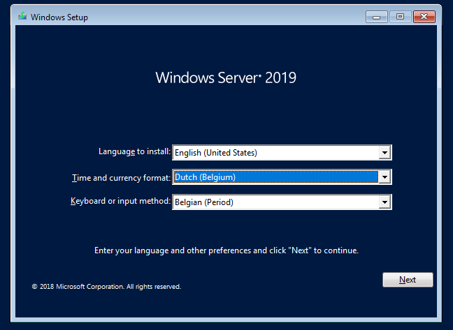
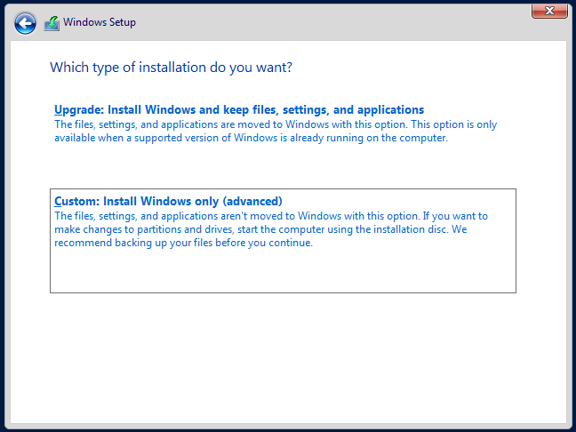
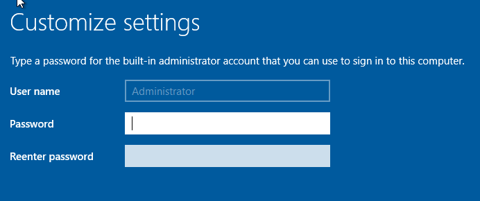
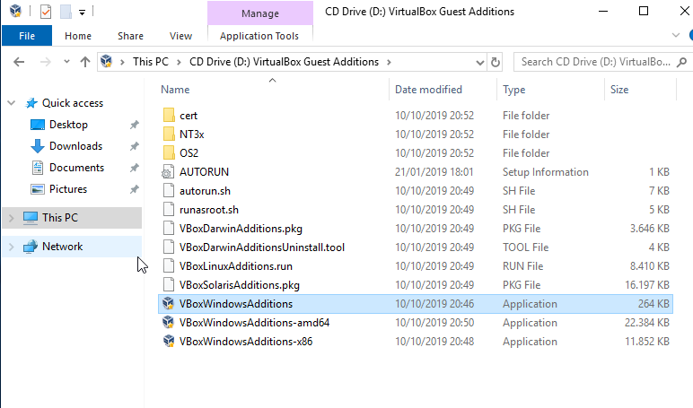

# Handleiding installatie DC1
Prerequisites:
- Virtualbox software
- Windows Server 2019/2016 iso file
- Voldoende RAM geheugen om VM's te runnen

## Stap 1: VM aanmaken in Virtualbox
Open Virtualbox en klik op   

Vervolgens kies je voor deze instellingen  

Klik op `Volgende`, nu moet je RAM geheugen toewijzen aan de VM. Het is aangeraden om dit **minstens** op **2048MB** te zetten:
  
Klik `Volgende`, en doorklikken op `Aanmaken`.  

Vervolgens klik je op `Expertmodus`, dit dient om de harde schijf een basis grootte van 50GB te geven:
  
Eens dit is ingesteld op 50GB klik je op `Aanmaken`

De VM is nu aangemaakt, maar er moeten nog wat instellingen gewijzigd worden:
- Rechtermuis op de VM en klik op `Instellingen`
- In het tabblad `Systeem` zorg je ervoor dat `Optisch` aangevinkt en bovenaan staat (met de pijltjes)
- Onder het tabblad `Netwerk` klik je op `Adapter 2`, vink dit aan en kies een Host-Only Adapter (onthoudt het nummer)
- Nu klik je op het Tabblad `Opslag` en vervolgens op de Lege schijf die staat afgebeeld. 
    - Hier geef je nu je Windows Server 2019 ISO file mee die je op je pc hebt staan. (Zie afbeelding)

  

- Klik op `OK`

### Netwerk correct instellen
Het is belangrijk dat de adapters juist zijn zodat er een virtueel netwerk beschikbaar is.

- In VirtualBox, ga naar het tabblad Netwerk (zie afbeelding)

- Zorg ervoor dat de Host-Only adapter die je daarnet hebt gekozen een correct IP heeft, stel deze in als volgt:

**Opmerking**: deze adapter moet nu voor elke server op hetzelfde # ingesteld worden.

Je bent nu klaar om de VM op te starten en vervolgens naar Stap 2 te gaan.

---

## Stap 2: Windows installeren met iso file
### Taal kiezen
Selecteer `Dutch (Belgium)` als time and currency format, de keyboard layout wordt automatisch mee aangepast.

Klik `Next` en vervolgens `Install now`

### Versie kiezen
Selecteer `Windows Server 2019 Standard Evaluation (Desktop Experience)` dit zorgt voor de handige Windows GUI 

- Klik vervolgens op `Next`
- Accepteer de License terms en klik nogmaals op `Next`

### Type installatie
Klik op `Custom install`  

Bij het volgend scherm klik je nogmaals op `Next`

**Nu begint de installatie van de OS, laat dit zijn gang gaan. Eens dit af is zal je een account kunnen aanmaken en inloggen**

Om dit labo gemakkelijker te maken zal de Administrator account op elke server hetzelfde wachtwoord hebben: `"adminPass123"`
Indien u deze handleiding volgt om een eigen netwerk op te stellen, gelieve dit **NIET** te doen. Kies uw eigen sterk wachtwoord en laat ze verschillen op elke server.

## Klonen van de VM
Om ons leven wat makkelijker te maken is het nu aangeraden om een kloon te nemen van de net opgezette VM. De reden hiervoor is dat we nu niet meer op deze lange Windows-installatie moeten wachten.  

### Guest Additions installeren
Eerst en vooral gaan we nog snel VirtualBox Guest Additions installeren, dit is op iedere host nodig om aan de shared folder te kunnen.

Eens de VM is opgestart doe je het volgende om Guest Additions te installeren:

De image is nu gemount, ga naar je C-schijf en open de CD-Image.
Je zou nu hier terecht moeten komen:

Dubbelklik op `VBoxWindowsAdditions` en doorloop heel deze Wizard zonder iets te veranderen.  
Op het einde wordt je VM gereboot.

### Hoe klonen?
In Virtualbox: 
- Zet de VM eerst uit: 
    - Rechtermuis op de net aangemaakte VM
    - `Sluiten` -> `Uitzetten`
- Klonen
    - Rechtermuis op de VM
    - `Klonen` -> Instellingen zoals de volgende afbeelding (naam is zelf te kiezen)

    
    - Kies vervolgens voor een `Volle kloon` en klik dan op `Kloon`
    - Laat deze VM voorlopig uit staan, we komen hier later op terug

**Opmerking**: Idealiter kloon je de VM 2x (aangezien we deze nogmaals gaan nodig hebben voor `WIN-SQL-SCCM`).
---

## Stap 3: Installatie van DC1
Nu gaan we aan de slag met de scripts, eerst en vooral moeten deze scripts op de VM's zelf terecht komen. We pakken dit als volgt aan.

### Shared folder mounten
- Zet de VM terug uit, rechtermuis op de VM en ga naar `Instellingen`.
- Onder het tabblad `Gedeelde mappen` maak je een nieuwe entry aan:

Bij `Pad naar map` geef je de locatie van de folder `WIN-DC1` op. Vink `Automatisch koppelen` en `Permanent maken` aan.

### Uitvoeren scripts

Nu kunnen we eindelijk aan de slag met het configureren van de VM.
In de shared folder op de VM zie je allemaal script bestanden:

  

**Opmerking**: De scripts bevatten default values voor domeinnaam, DHCP ranges, IP instellingen en wachtwoorden. Dit kan je allemaal eenvoudig aanpassen in de scripts zelf.

Om de installatie te starten doe je rechtermuis op `Step1` en vervolgens `Run with PowerShell`.  

Alles zal nu automatisch verlopen. De computer zal 3x opnieuw opstarten, na elke reboot zal je opnieuw moeten inloggen met het wachtwoord dat je gekozen hebt (in mijn opstelling is dit `adminPass123`). Het script zal automatisch verder uitvoeren.

Na de derde reboot is de server klaar om te gebruiken, proficiat!
