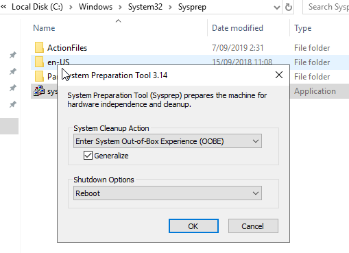

# Handleiding installatie DC1
Prerequisites:
- Virtualbox software
- Gekloonde VM (van DC1)
- Voldoende RAM geheugen om VM's te runnen

## Stap 1: VM klaarmaken voor gebruik
We werken nu verder met de kloon die je hebt gemaakt bij DC1.  
Om niet in herhaling te vallen ga ik soms verwijzen naar stappen die we reeds gezien hebben.

### Adapters instellen
Deze VM mag maar 1 adapter hebben. Ga naar `Instellingen` en onder het tabblad `Netwerk` verander je de `NAT`-interface naar `Host-Only Adapter` (hetzelfde nummer als bij WIN-DC1).

### Nieuwe SID (Security Identifier) aanmaken
Omdat dit een kloon is, is het belangrijk dat we de SID vernieuwen, of anders zou deze VM het domein niet kunnen joinen.

In de verkenner surf je naar `C:\Windows\System32\Sysprep` en open het programma `Sysprep.exe`

Vink `Generalize` aan en klik `OK`  

Na het rebooten kom je terug op een wizard waar je wat instellingen moet aanpassen (dit zijn dezelfde instellingen als bij DC1, dus doe dit nu opnieuw).

### Shared folder
Hier gaan we opnieuw een gedeelde map maken, volg hiervoor opnieuw de uitleg bij DC1. De enige verandering is dat we nu de map `WIN-DC2` gaan mounten. [Handleiding shared folder](./WIN-DC1.md#Stap3) 

--- 

## Stap 2: Uitvoeren scripts
**BELANGRIJK**: `WIN-DC1` moet up en running zijn voor een correcte installatie!

Nu kunnen we weer beginnen met de installatie. Nogmaals, indien je variabelen hebt veranderd bij WIN-DC1, zal je die nu ook moeten veranderen in deze scripts.

- Rechtermuis op `Step1` en klik op `Run with PowerShell`
- Indien je een melding krijgt ivm. `Execution Policy Change` dan typ je `A` en druk je op `enter`
- Meerdere reboots zijn mogelijk, telkens opnieuw inloggen met je gekozen wachtwoord

Als de VM niet meer reboot dan is de server nu gepromoveerd tot 2e domein controller! 

**EXTRA**: Je kan nu nog deze server als een Failover DHCP server configureren. Dit kan je eenvoudig doen door op `WIN-DC1` het scriptje `Failover.ps1` te runnen.
